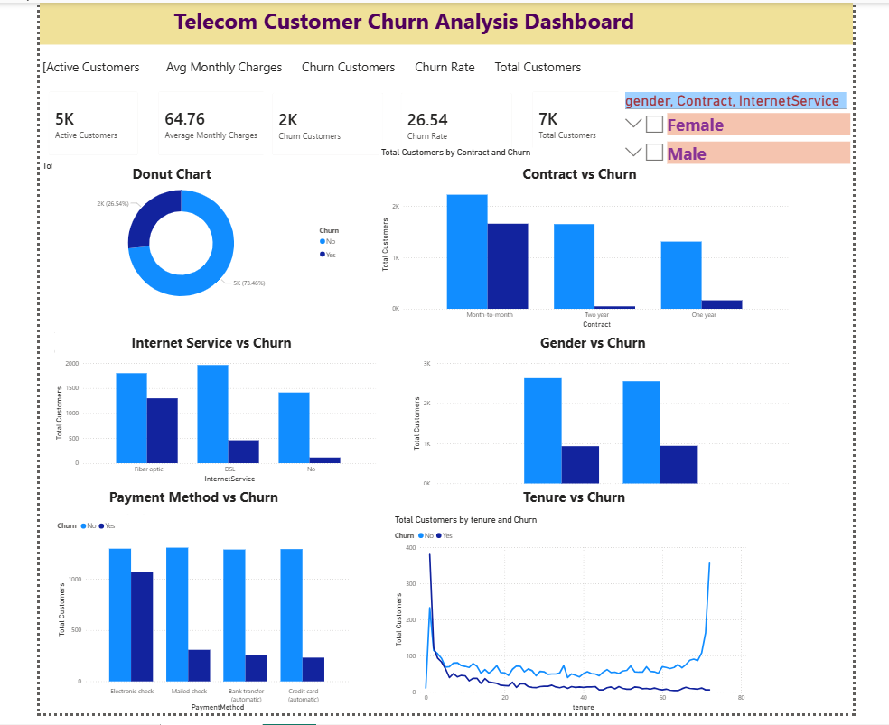

# Telecom Customer Churn Analysis - Power BI

## Project Overview
This project analyzes telecom customer churn patterns using Power BI. The dashboard helps identify customer retention trends, churn behavior, contract impact, payment preferences, and internet service usage.

## Tools Used
- Power BI
- Power Query
- DAX
- Excel/CSV Dataset

## Key KPIs
- Total Customers
- Active Customers
- Churn Customers
- Churn Rate
- Average Monthly Charges

## Dashboard Insights
- Churn analysis by Contract Type
- Churn analysis by Gender
- Churn analysis by Internet Service
- Churn analysis by Payment Method
- Tenure vs Churn trend analysis

## Files Included
- Telecom_Customer_Churn_Analysis.pbix
- WA_Fn-UseC_-Telco-Customer-Churn.csv
- dashboard.png

## Dashboard Preview

## Author
Nandini
